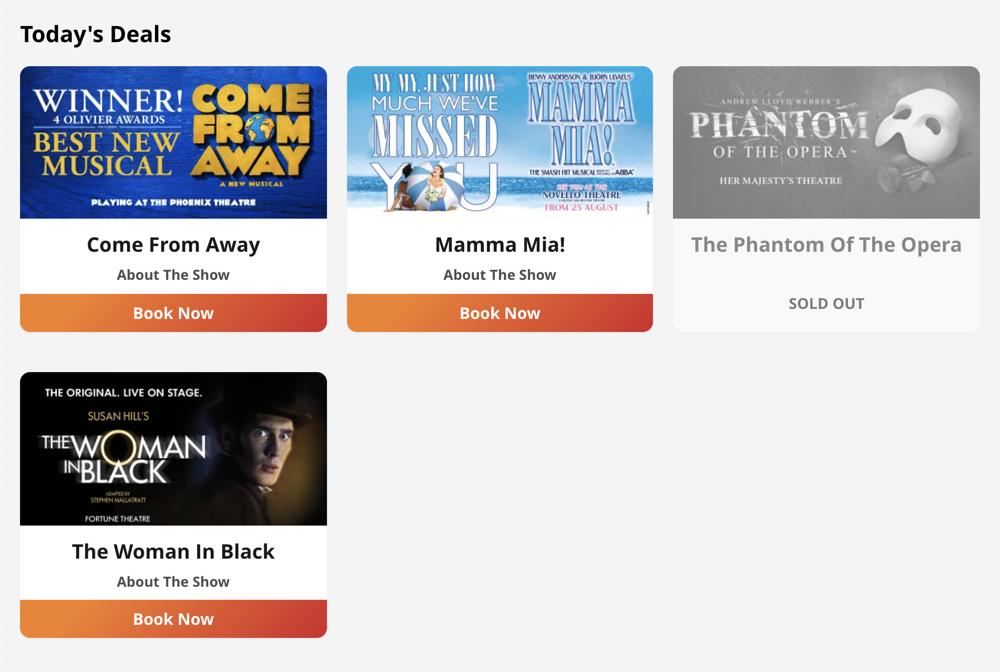

# SOLT Junior Tech Test

Congratulations on being selected to progress to the next stage of the interview process and to complete our tech test. The purpose of this test is to assess the quality of the code that you write, your approach to problem solving, and your ability to reason about the approaches and practices you have implemented.

There isn't necessarily a correct or perfect submission for this test, different approaches have various benefits and downsides, however you will be expected to defend your decisions if you are asked to attend a face-to-face interview.

In the same vein, do not worry too much about how much progress you make through each part of the test, but rather make sure that what you do complete is of a high, production-ready, standard. We expect you to spend around 3 hours on this task (feel free to spend more time on it if you wish).

If you have any questions please do not hesitate to contact us.

## The Task
---

As a Junior Developer at SOLT, you will be required to implement new features and maintain current ones across the front end of our sites.

For this task, we would like you to build a simple React component that consumes our `/shows/all-open` endpoint and displays the shows on the browser.
### React Component

Recreate the component in the attached "react-component.jpg" image by fetching the shows from this [endpoint](https://officiallondontheatre.com/wp-json/shows/all-open).

In the `/shows/all-open` endpoint you will find a `see_tickets_url_infos` property that stores an array of booking links. If the array is empty, then that show should appear as "SOLD OUT". If there are items in the array, then you should pick the url with a subdomain of `tktsonline.seetickets.com` as the booking link and if that is not available fallback to using the `officiallondontheatre.seetickets.com` url.

- Shows should be displayed on a single column grid on mobile device, two columns on medium size screens and three columns for large screens
- Each show tile should include the show image, title and click through to the correct booking link
- "SOLD OUT" shows should be greyed out with a label of "SOLD OUT" in place of the "BOOK NOW" CTA. You should also **not** be able to click on these tiles.
- Show tiles on the same row should all be equal height

## Project Setup
---

We recommend you use `create-react-app` as this will give you a lot of functionality for free, however if you have your own boilerplate then you are welcome to use that instead. Please separate the boilerplate and your own work into separate commits to make the work of the reviewers easier.

Please include a COMMENTS.md with any decisions you made that you feel are worth highlighting and concessions you had to make due to the time constraints, as well as anything else you think we should be aware of when reviewing your code.

